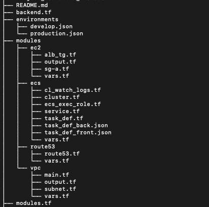

# Back + Front App Terraform 

## Descrição

O objetivo deste projeto e criar a infraestrutura em cloud AWS para rodar uma aplicação com frontend e backend hipotética. No frontend ira rodar uma instância de imagem docker e no backend 2 instâncias de imagem docker.

### Recursos utilizados AWS

- Route 53
- Application Load Balancer
- Fargate
- ECR
- VPC (Novas Subnets)

### Build das Aplicações backend e frontend

Para o build das imagens de backend e frontend foi utilizado o Azure DevOps.

Para o deploy da infra através do terraform, foi orquestrado também através do Azure DevOps.

Maiores informções pode ser verificadas no link abaixo:

[Documentação Auxiliar](Projeto_Terraform_AWS.docx)

### Terraform

Foi desenvolvido o terraform utilizando o conceito de modularização, e para controle de ambientes foi utilizado o conceito de Workspace.

## Roadmap

Uma alternativa futura a considerar seria o uso do serviço de CDN Cloudfront da AWS para hospedar a aplicação de frontend, com isso a aplicação terá ganhos como menor latência de acordo com a origem da requisição, conteúdo distrbuído geograficamente com possibilidade de cache gerando respostas mais rápidas para as solicitações entre outras vantagens.

